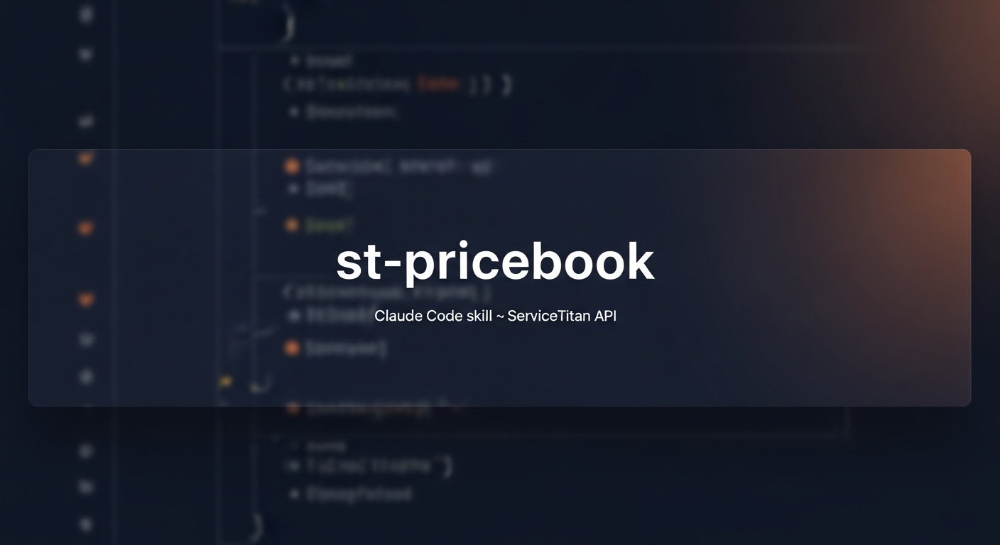

<p align="center"></p>

# st-pricebook

A [Claude Code](https://claude.ai/code) skill that captures hard-won knowledge about the **ServiceTitan Pricebook v2 API** — schemas, endpoints, the silent-fail field catalog, safe-update patterns, bulk import workflows, and an incident log so you don't repeat the same mistakes.

If you've ever PATCHed an ST pricebook item, received a 200 OK back, and then quietly discovered the field never changed — this skill is for you.

## What it covers

- **Full silent-fail catalog** — every field ST drops on POST or PATCH, when each was discovered, and the workaround (`cost` on services, `useStaticPrice[s]`, `typeId`, `variationsOrConfigurableEquipment`, category `name`, status PATCH on estimates, etc.)
- **Excel / CSV bulk-import pattern** — file shapes, validation, dry-run, batched POST/PATCH with read-after-write hash verification
- **Configurable equipment & materials** — `primaryVendor` object shape, `displayName` vs `name`, `categories: [<int>]` integer-array convention, the `isConfigurableEquipment` flag, variant management
- **Estimate / proposal templates** — the bit that isn't in `/sales/v2/` (lives at internal `/app/api/estimates/templates/*` with read↔write schema asymmetries)
- **Write safety** — dryRun + HMAC confirmation + read-after-write hash-compare pattern for any framework
- **Dynamic vs static pricing** — the tri-state `useStaticPrices` model that long-lived ST tenants run on
- **D1 sync architecture** — schemas, sync endpoints, why pricebook tables typically aren't on a nightly cron
- **Incident log** — dated postmortems with lessons encoded back into the skill

## Who it's for

- Engineers integrating with the ServiceTitan API who don't want to repeat ~6 months of production debugging
- Claude Code users wanting an authoritative skill for ST pricebook work
- Anyone doing bulk pricebook imports, category cleanups, or estimate template authoring
- People who would rather read a verified gotcha catalog than rediscover each one in production

## Install

### As a Claude Code skill

```bash
# In your project (or globally at ~/.claude/skills/)
cp -r st-pricebook ~/.claude/skills/
```

Claude Code will auto-discover the skill from your skills directory. Trigger it by asking about ServiceTitan pricebook work (or it'll trigger on its own when relevant).

### As plain reference

The skill is just markdown. Read `SKILL.md` for the overview and the files under `references/` for deep dives. No tooling required.

## Substitution checklist

The skill ships tenant-agnostic. Replace these placeholders with your values:

| Placeholder | What to set |
|---|---|
| `{tenantId}` | Your ServiceTitan tenant ID |
| `{d1DatabaseId}` | Your Cloudflare D1 database ID (if you're mirroring pricebook to D1) |
| `<your-sync-key>` | Your worker-to-worker auth header value |
| `<your-worker-name>` | Your sync worker's name |
| `<your-voice-agent>` | Your voice / search agent name (if applicable) |

If you're working in the original QSC repo this skill was extracted from, `local.md` (gitignored) holds the real values.

## Reference index

| Task | Open this file |
|---|---|
| Endpoint, schema, or auth question | [`references/api-reference.md`](references/api-reference.md) |
| Field silently dropped on POST/PATCH | [`references/silent-fail-catalog.md`](references/silent-fail-catalog.md) |
| Need a safe-update pattern | [`references/write-safety.md`](references/write-safety.md) |
| Bulk import from Excel/CSV | [`references/excel-import.md`](references/excel-import.md) |
| Configurable equipment or materials | [`references/configurable-equipment-and-materials.md`](references/configurable-equipment-and-materials.md) |
| Cost vs price, dynamic vs static | [`references/cost-and-pricing.md`](references/cost-and-pricing.md) |
| Batch operations, retries, recovery | [`references/batch-operations.md`](references/batch-operations.md) |
| Category tree, IDs, renames | [`references/category-discovery.md`](references/category-discovery.md) |
| `serviceMaterials` / `serviceEquipment` linking | [`references/service-links.md`](references/service-links.md) |
| Estimate templates, proposals, status transitions | [`references/estimate-and-proposal-templates.md`](references/estimate-and-proposal-templates.md) |
| What we've learned the hard way | [`references/incidents-and-lessons.md`](references/incidents-and-lessons.md) |

## Contributing

PRs welcome. Especially valuable:

- **New gotcha entries** in the silent-fail catalog — please include the date you verified it and (if possible) the request/response shapes
- **Workarounds** for documented gotchas
- **Cross-tenant verification** — confirming a gotcha reproduces on a different ST tenant strengthens the catalog
- **Fixes** when ST patches a gotcha — they do happen occasionally

Please don't include real tenant IDs, customer data, or proprietary item codes in your contributions.

## License

[MIT](LICENSE)

## Acknowledgments

Original author and contributors: see [AUTHORS.md](AUTHORS.md).
